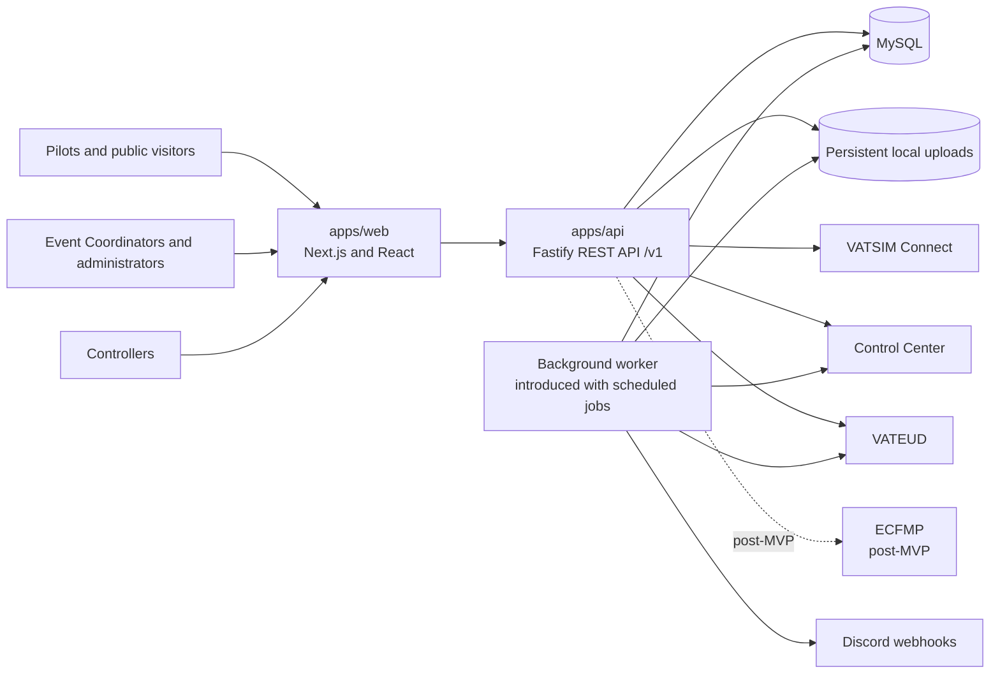

# System context and package boundaries

## Context

Event Hub is one product with separately deployable web, API, and background
processing concerns. MySQL is the system of record. External identity,
eligibility, messaging, and event-data providers are accessed only through
server-side adapters.



## Target repository layout

Issue #2 owns the initial scaffolding. The target boundaries are:

```text
apps/
  web/          Next.js UI, public server-rendered pages, and interactive staff areas
  api/          Fastify HTTP API and composition root
  worker/       Background-job process when scheduled work is introduced
packages/
  contracts/    Versioned runtime request and response schemas
  database/     Prisma schema, migrations, generated client, and seed support
  domain/       Framework-independent domain types and policies where sharing is justified
  config/       Validated environment configuration
  ui/           Reusable shadcn/ui-based components where cross-feature reuse is real
  testing/      Shared test builders and infrastructure
```

The layout is a target, not permission to create empty packages pre-emptively.
A package should be introduced when its first consumer exists.

## Boundary rules

### Web

- Uses Next.js and React with Tailwind CSS and shadcn/ui.
- Uses server rendering for public event discovery, event metadata, and link
  previews.
- Uses client-side navigation and interactions for a responsive, SPA-like
  authenticated experience.
- Calls the API through versioned contracts.
- Does not import Prisma, the generated database client, API repositories, or
  server-only integration credentials.
- May perform presentation-specific aggregation, but business authorization
  and state transitions remain in the API.

### API

- Owns the `/v1` HTTP boundary, authentication callbacks, authorization,
  application services, persistence, upload authorization, and integration
  adapters used during requests.
- Validates every request and serialized response against shared contracts.
- Is the only HTTP application allowed to access the database.
- Returns stable domain-facing errors rather than leaking Prisma, MySQL, or
  provider errors.
- Treats anonymous access as an explicit authorization policy, not as a
  missing-authentication shortcut.

### Background worker

- Runs synchronization, reminders, archival, and cleanup outside request
  handlers.
- Reuses application/domain services rather than calling private API routes.
- Executes idempotent jobs with durable scheduling or recoverable due-work
  state.
- Is deployed separately only when issue #44 introduces scheduled work.

### Shared contracts

- Define versioned request, response, pagination, and error shapes.
- Use TypeBox schemas for runtime validation and inferred TypeScript types.
- Contain no database models, React components, secrets, or provider payload
  types.
- Make breaking changes through a new API version or an explicitly documented
  compatibility path.

### Database

- MySQL is the source of truth for Event Hub state.
- Prisma access is owned by server-side code in `packages/database`.
- Provider payloads are normalized before persistence; raw payload retention
  must have an explicit support or audit purpose.
- Migrations are reviewed artifacts and are applied before code that depends on
  them is started.

### File storage

- Files are stored outside the web application's static/public directory.
- Database records hold metadata and opaque storage keys; generated keys, not
  user filenames, determine disk paths.
- Downloads pass through an authorized API path.
- The storage interface must permit a later move to S3-compatible object
  storage without changing event contracts.

## Dependency direction

The intended dependency direction is:

```text
web -> contracts
api -> contracts + application/domain + database + integrations + storage
worker -> application/domain + database + integrations + storage
database/integrations/storage -> domain-facing interfaces
```

Domain and contract packages must not import an application framework. The
database must not become a shortcut boundary shared with the web application.
